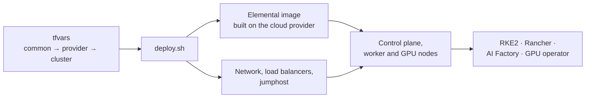

<div align="center">


# SUSE AI Factory on cloud providers

**One Terraform repository to deploy SUSE AI Factory on different cloud providers.**

SLES · RKE2 · Rancher · SUSE AI Factory (powered by SUSE Elemental)

[](https://github.com/e-minguez/suse-ai-factory-cloud-providers/actions/workflows/ci.yml)
[](LICENSE)
[](docs/workarounds.md)

[Quickstart](#quickstart) · [Architecture](docs/architecture.md) · [Providers](#supported-providers) · [Multi-cluster](#multi-cluster) · [Documentation](#documentation)

</div>

> [!CAUTION]
> **This is NOT an official SUSE project or product and is not supported by SUSE.**
> **It is a community, personal project. Use it at your own risk.**

## Features

- The same variable names, outputs, labels and `deploy.sh` interface on every
  provider. To switch providers, use another `examples/<provider>` directory.
- Each cluster boots a SUSE Elemental image with RKE2 and the cluster
  configuration built in. The image is built on the cloud provider, on the
  cluster's jumphost: the workstation that runs Terraform needs no image
  tooling, container runtime or local disk space for it. The image is rebuilt
  only when one of its inputs changes.
- GPU nodes in `gpu_pools` with the NVIDIA GPU operator, next to `worker_pools`,
  on VMs or on bare metal where the provider offers it.
- Scale out control plane nodes, workers and GPU nodes, or add new pools, at
  any time: only the new nodes are created, with no new image. A cluster can
  start with a single control plane node and grow to three or more.
- `deploy.sh` lists what will be replaced or destroyed, asks before it applies,
  and runs every pass the provider needs.
- `tools/multicluster` creates several clusters from one checkout and imports
  them into the Rancher of a management cluster, across providers.
- A tool estimates the cost of each cluster from its configuration before you
  deploy it.



## Supported providers

| Provider | Passes | Image | Default hostnames | Notes |
|---|:---:|---|---|---|
| **aws** | 1 | Raw image uploaded to S3, imported as an EBS snapshot and AMI | NLB DNS names | [aws.md](docs/providers/aws.md) |
| **evroc** | 2 (+1 optional) | Raw image written to a disk, one snapshot per zone | sslip.io | [evroc.md](docs/providers/evroc.md) |
| **exoscale** | 2 | Raw image converted to qcow2, served over HTTP, template per zone | sslip.io | [exoscale.md](docs/providers/exoscale.md) |
| **vultr** | 2 | Raw image served over HTTP, account-wide snapshot from the URL | sslip.io | [vultr.md](docs/providers/vultr.md) |

Each provider has an example root with its own README:
[examples/aws](examples/aws/README.md),
[examples/evroc](examples/evroc/README.md),
[examples/exoscale](examples/exoscale/README.md),
[examples/vultr](examples/vultr/README.md).

## Quickstart

**Requirements:** Terraform 1.16.4 or later ([why](docs/workarounds.md)), `jq`, `ssh`
and provider credentials. aws also needs the AWS CLI, evroc the evroc CLI login,
exoscale `curl` and `openssl` (signed API checks).

**1. Shared values.** Copy `common-all.tfvars.example` to `common-all.tfvars` at
the repo root and fill in what every cluster shares: admin CIDRs, SSH keys,
password hashes, registry credentials, `aif_release`.

**2. Cluster values.** Pick a provider and set the cluster-specific values:

```bash
cd examples/<provider>
cp terraform.tfvars.example terraform.tfvars
$EDITOR terraform.tfvars
```

**3. Optional: estimate the cost** (from the repo root; aws, evroc and vultr).

```bash
make cost PROVIDER=<provider> TFVARS="common-all.tfvars examples/<provider>/terraform.tfvars"
```

**4. Deploy.**

```bash
./deploy.sh
```

**5. Connect.** When the deploy finishes it prints the Rancher URL and the
commands to fetch the kubeconfig and open an SSH session. It runs neither:

```bash
scripts/kubeconfig.sh -C examples/<provider> -o ~/.kube/<cluster>.yaml   # mode 600
scripts/ssh.sh -C examples/<provider> <hostname|jumphost>
scripts/build-logs.sh -C examples/<provider>                             # follow the image build
```

A cluster created with `tools/multicluster/cluster.sh new` has these scripts
linked into its directory, so `clusters/<name>/ssh.sh <host>` works from
anywhere.

### Variable files

`deploy.sh` loads these files, later wins: `../../common-all.tfvars` (repo root),
`../common-all.tfvars`, `../common-<provider>.tfvars`, `terraform.tfvars`.
Provider credentials and defaults go in `examples/common-<provider>.tfvars`.
`common-all.tfvars` may only set variables every provider declares. A later file
replaces a whole value: a `tags` map in `terraform.tfvars` replaces the shared one
instead of merging with it ([conventions](docs/conventions.md#variable-files)).

### `deploy.sh`

```
deploy.sh [--rebuild] [--yes] [-v|-q] [--destroy] [-- <terraform args>]
```

Same interface on every provider. `--rebuild` bumps a persisted counter that
feeds the image `build_hash`, so a new image is built and the nodes are replaced
([ADR 003](docs/decisions/003-rebuild-counter.md)). `--destroy` shows the destroy
plan, asks, and then prints the read-only leftover check for the provider.

## Deployment flow

Each pass runs `plan -out`, lists replacements and destroys, asks for
confirmation (unless `--yes`), applies the saved plan and renders the output.
Full logs go to `.deploy/logs/<timestamp>/` (gitignored). The number of passes
depends on the platform:

- **aws, 1 pass.** The API address is known at plan time and load balancer
  attachments are separate resources, so nothing depends on a created instance.
- **vultr, 2 passes.** The load balancer backends depend on nodes built from an
  image whose serving address depends on the load balancer. Pass 1 creates the
  infrastructure and the image; pass 2 attaches the backends.
- **evroc, 2 passes plus an optional third.** A disk cannot be attached and
  detached in one apply. Pass 1 builds the image, pass 2 snapshots it and
  creates the nodes, and the optional pass 3 reclaims the build disks.
- **exoscale, 2 passes.** The load balancer targets an instance pool, whose
  members share one configuration. Pass 1 starts the control plane pool with
  one member that initializes the cluster; pass 2 switches it to the join
  configuration and scales it up.

Diagrams of each pass, the image pipeline and the network:
[docs/architecture.md](docs/architecture.md).

<details>
<summary><b>Running Terraform directly</b></summary>

Plain `terraform` only reads `terraform.tfvars` (and `*.auto.tfvars*`) from the
current directory, so it asks for the shared values. Pass the same var files
`deploy.sh` uses, in the same order (skip any that do not exist; `deploy.sh`
prints the resolved list on its `var-files` line):

```bash
terraform plan \
  -var-file=../../common-all.tfvars \
  -var-file=../common-all.tfvars \
  -var-file=../common-<provider>.tfvars \
  -var-file=terraform.tfvars
```

The same arguments work for `apply`, `destroy`, `console` and `import`.
[docs/manual-deploy.md](docs/manual-deploy.md) lists every `deploy.sh` pass per
provider as plain `terraform` commands.

</details>

## Multi-cluster

`tools/multicluster` runs several clusters from one checkout and imports them
into the Rancher of a management cluster, across providers.

```bash
tools/multicluster/cluster.sh new <provider> <name>
tools/multicluster/cluster.sh deploy <name>
tools/multicluster/cluster.sh register <mgmt> <downstream...>
```

Details: [tools/multicluster/README.md](tools/multicluster/README.md).

## Configuration notes

### Hostnames

aws uses the NLB DNS names; evroc, exoscale and vultr use sslip.io names on the load
balancer IP. For production set `rancher_hostname` and `api_host` to your own DNS
names that resolve to the load balancer. `api_host` goes into the RKE2 API
certificate (`network.apiHost`); aws also adds both load balancer names and the
API VIP as `tls-san`.

### Single-node clusters

`control_plane_count = 1` deploys one control-plane node and keeps everything
else: jumphost, API and ingress load balancers, firewall rules and the API VIP.
Nodes join through the API load balancer, so growing the cluster means setting
`control_plane_count` to 3 (or any odd number) and running `deploy.sh` again. The
existing node is kept ([docs/scaling.md](docs/scaling.md)).

- With the default `suse_storage_nodes = ["control_plane"]`, plan fails when
  `suse-storage` is listed with `control_plane_count = 1`; see [Storage](#storage).
- Shrinking back to 1 is not supported: it removes etcd members.

### Storage

Control-plane nodes are RKE2 servers; `worker_pools` and `gpu_pools` nodes are
RKE2 agents. Storage comes from one of two components:

- `local-path-provisioner`: a volume is stored on the node that runs its pod. The
  data directory is prepared on every node.
- `suse-storage` (Longhorn): default disks are created only on the nodes
  selected by `suse_storage_nodes`, by role (`control_plane` (default), `worker`,
  `gpu`) and/or by pool key, for example `["control_plane", "storage"]`. Plan
  fails when fewer than three nodes would get disks. A worker pool cannot be
  named `gpu`, nor a GPU pool `worker`. The selection is in each node's Ignition,
  not in the image, so changing it does not rebuild the image
  ([what happens to existing nodes](docs/scaling.md#storage)).

### Registry credentials

| Variables | Required | Used for |
|---|---|---|
| `appco_username`, `appco_password` | with `local-path-provisioner` (default) or `suse-storage` | Application Collection chart pulls and image pull secret |
| `suse_registry_username`, `suse_registry_password` | no | SUSE registry credentials in the aif-operator values |
| `nvidia_api_key` | no | NVIDIA NGC credentials in the aif-operator values |

With `aif-operator`, set all of them so AI Factory can pull its workloads right
after the deployment. Plan prints a warning that names any missing ones; the
deployment itself does not need them. Each pair is set together or not at all.

## Tools

| Tool | What it does |
|---|---|
| `tools/multicluster` | Several clusters from one checkout, imported into a management Rancher ([above](#multi-cluster)). |
| `make cost PROVIDER=<p> TFVARS="..."` | Cost estimate from tfvars before a deploy; an estimate, not a quote ([tools/cost](tools/cost/README.md)). |
| `tools/leftovers/<provider>.sh <cluster_name>` | Read-only check for cluster objects still in the account after a destroy (aws `--region`, evroc optional `--region`, exoscale optional `--region` and needs `EXOSCALE_API_KEY` and `EXOSCALE_API_SECRET`, vultr needs `VULTR_API_KEY`). Exit 0 nothing live, 1 live or unknown, 2 usage, 3 inconclusive. |
| `tools/orphans/evroc [--adopt]` | Run in `examples/evroc`: lists evroc objects missing from the state and writes `import` blocks for them. `deploy.sh` prints it after a Terraform crash, or runs it when `EVROC_ADOPT_ON_CRASH=1` ([workarounds](docs/workarounds.md)). |
| `tools/vultr/passthrough-stock.sh [region ...]` | Vultr GPU passthrough plans in stock per region. Needs `VULTR_API_KEY`, `curl` and `jq`. |

## Security

Details in [docs/security.md](docs/security.md).

- Terraform state is secret: it contains the RKE2 token, passwords and registry
  credentials. Use an encrypted remote backend and restrict access to it.
- `scripts/kubeconfig.sh` is never run automatically. It prints to stdout; `-o`
  writes a mode 600 file and refuses to overwrite without `--force`.
- `scripts/ssh.sh` uses a temporary `ssh_config` and `known_hosts`, with
  `ProxyJump` through the jumphost.
- Nodes have no sudo. Log in as `node_username`, then `su -` for root.
  `permit_root_ssh` is a debug toggle, off by default.

## Documentation

| Document | Contents |
|---|---|
| [Architecture](docs/architecture.md) | Diagrams: deploy flow, image pipeline, passes and network per provider |
| [Provider notes](docs/providers/aws.md) | Platform behavior per provider: [aws](docs/providers/aws.md), [evroc](docs/providers/evroc.md), [exoscale](docs/providers/exoscale.md), [vultr](docs/providers/vultr.md) |
| [Conventions](docs/conventions.md) | Variable names, labels, the output set, checklist for a new provider |
| [Scaling](docs/scaling.md) | Adding nodes and pools, storage changes |
| [Manual deploy](docs/manual-deploy.md) | The `deploy.sh` passes as plain `terraform` commands |
| [Security](docs/security.md) · [Workarounds](docs/workarounds.md) · [E2E checklist](docs/e2e-checklist.md) | Security model, upstream workarounds, end-to-end checks not yet run |
| [Decision records](docs/decisions/README.md) | Reasons for the design choices |
| `modules/<name>/README.md` | Module inputs and outputs |

## Repository layout

```
modules/      shared modules (elemental-config, image-factory, rke2-ports) and one module per provider
examples/     single-cluster root per provider, each with a deploy.sh
scripts/      deploy.sh library, kubeconfig, ssh and build-log helpers
tools/        multicluster, leftovers, orphans, cost, vultr GPU stock
docs/         architecture, conventions, ADRs, workarounds, security, scaling, provider notes
```

## Development

`make help` lists the targets. `make ci` runs formatting, validation,
consistency, generated-docs, lint and test checks. After changing variables or
outputs, run `make docs`.

## License

Apache License 2.0. See [LICENSE](LICENSE).
