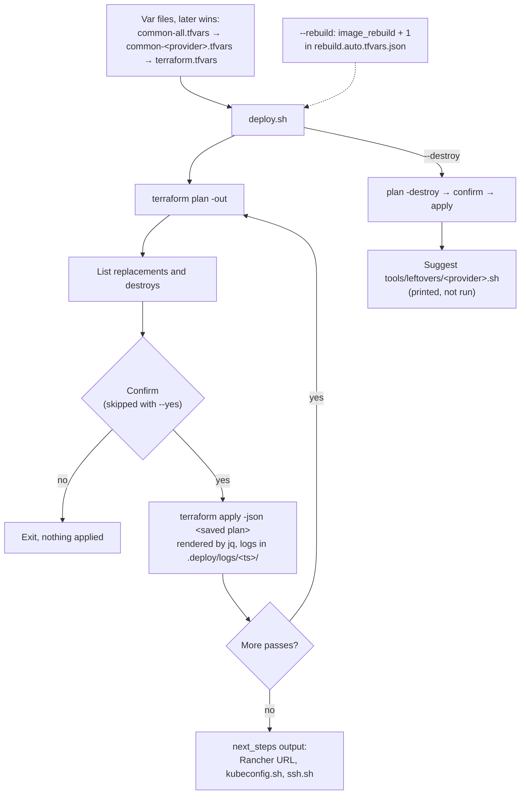
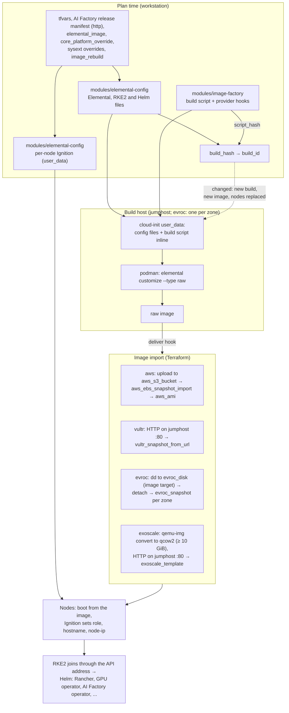
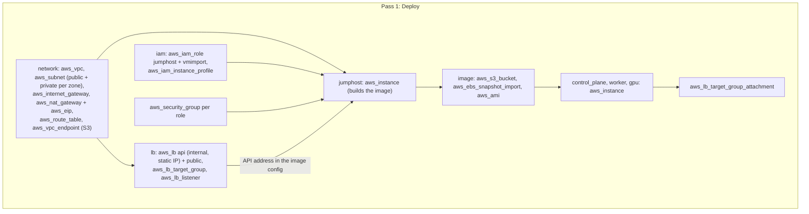
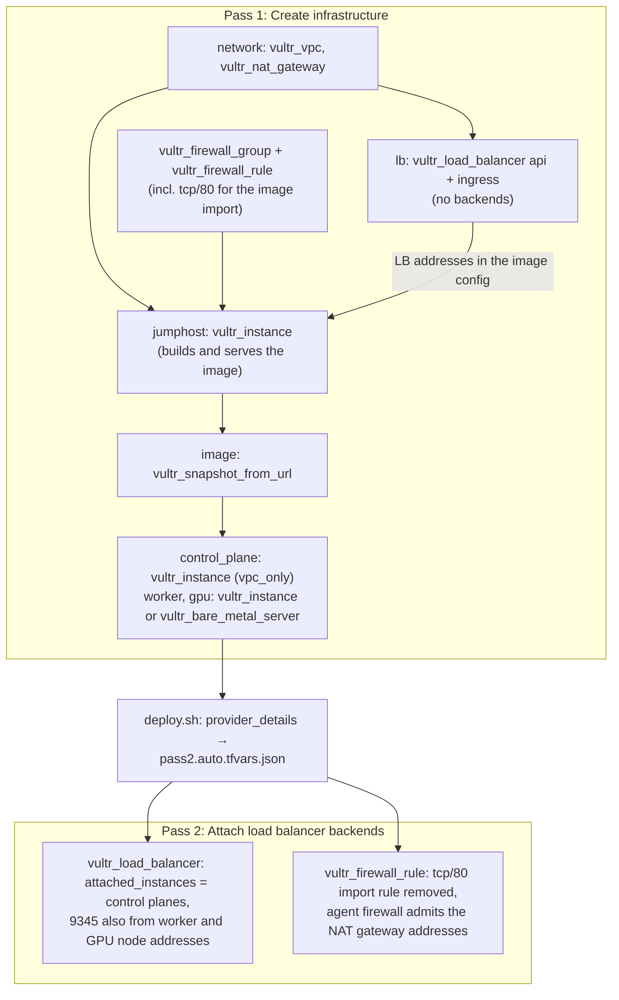
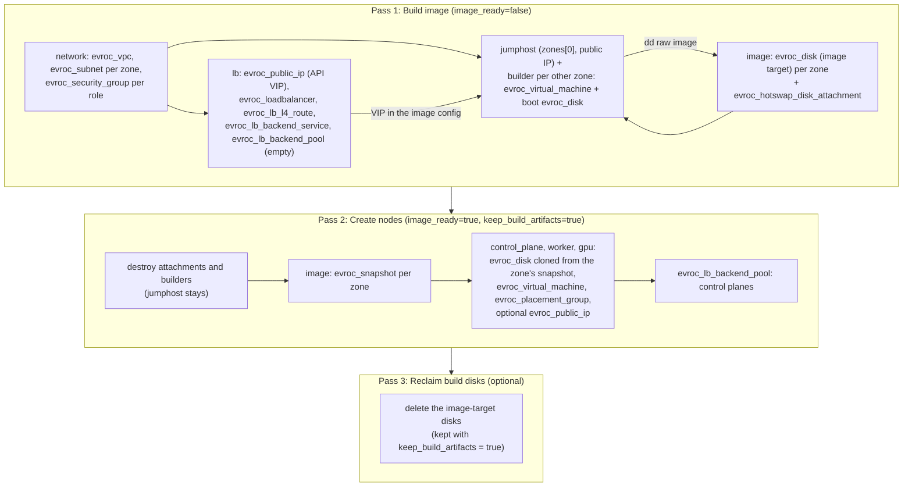
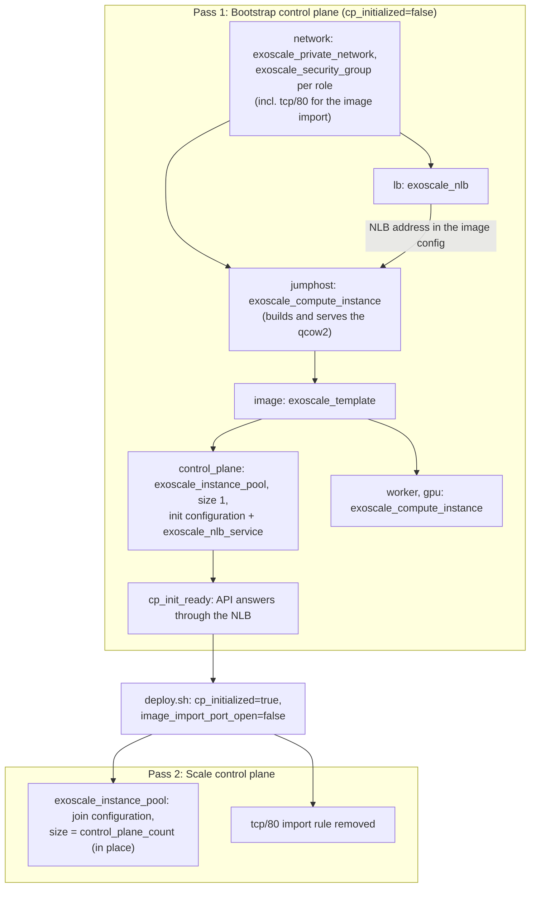
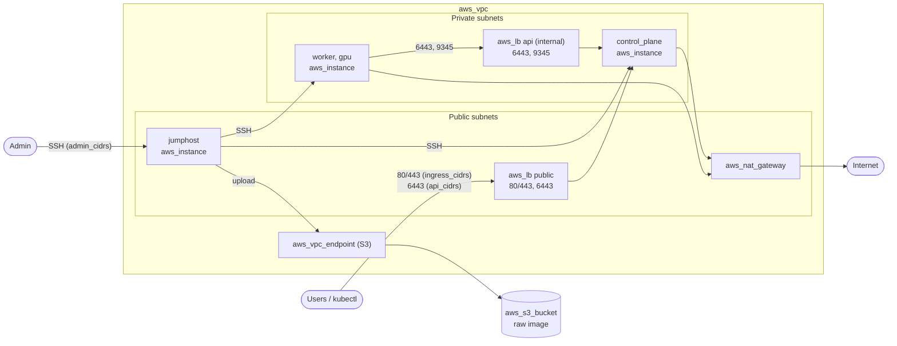
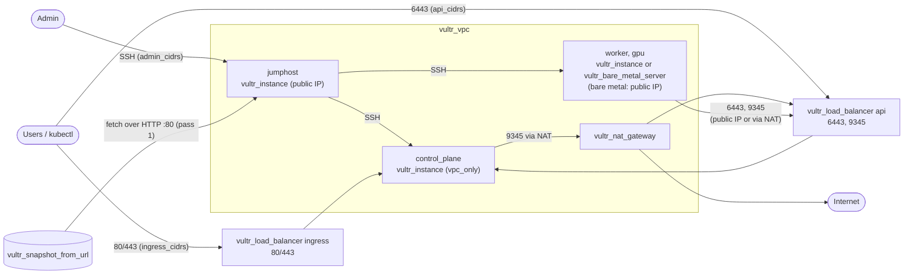
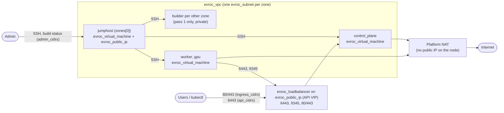
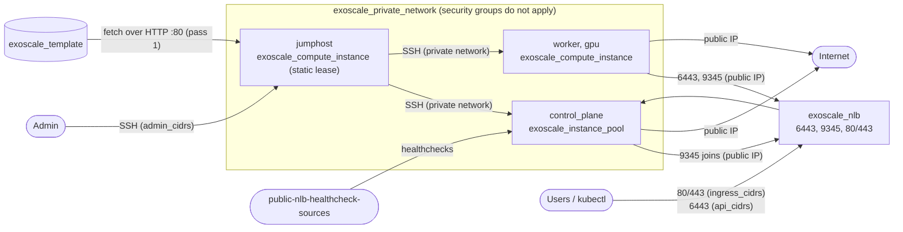

# Architecture

Diagrams of the deploy flow, the image pipeline, the passes per provider and the
network per provider. They show roles (see [conventions](conventions.md#labels))
and the main resource types; exact resource names, conditions and the reasons
behind each step are in the [provider notes](providers/aws.md) and the
[decision records](decisions/README.md).

## Deploy flow

`deploy.sh` defines the passes; `scripts/lib/tf.sh` runs each one the same way.

## Image pipeline

Every node boots one Elemental image built for the cluster. The image is rebuilt
only when `build_hash` changes; roles and hostnames go in per-node Ignition, so
changing the node set does not rebuild it.

Terraform waits for the build from the workstation: aws polls S3
(`wait-for-raw.sh`), vultr and exoscale poll the served URL
(`wait-for-image.sh`), evroc polls the build-status relay on the jumphost
(`wait-for-image.sh`).
`scripts/build-logs.sh` follows the build log on the build host over SSH.

## Passes

What each `deploy.sh` pass creates. Why the number differs:
[README](../README.md#deployment-flow).

### aws: one pass

The internal NLB address is fixed at plan time and target group attachments
are separate resources, so everything fits in one apply.

### vultr: two passes

The load balancer address is in the image and the backends are inline fields of
`vultr_load_balancer`, so the backends are attached in a second apply
([ADR 006](decisions/006-vultr-two-passes.md)).

### evroc: two passes plus an optional third

A disk cannot be attached and detached in one apply, and snapshots are zonal,
so pass 1 writes the image to one disk per zone and pass 2 snapshots them.

Once the snapshots are in state, `deploy.sh` runs one apply with
`image_ready=true`; `--rebuild` goes through all passes again.

### exoscale: two passes

The NLB targets instance pools only and a pool has one `user_data`, so the
control plane pool starts with one init member and switches to the join
configuration in a second apply ([ADR 008](decisions/008-exoscale-module.md)).

Once the pool is in state, `deploy.sh` runs one apply with the pins; a new
template reopens tcp/80 and a second apply closes it.

## Network

Main traffic paths. SSH always goes through the jumphost (`ProxyJump`,
`scripts/ssh.sh`); `admin_cidrs` filters the jumphost, `api_cidrs` the public
Kubernetes API, `ingress_cidrs` ports 80/443.

### aws

### vultr

### evroc

### exoscale

